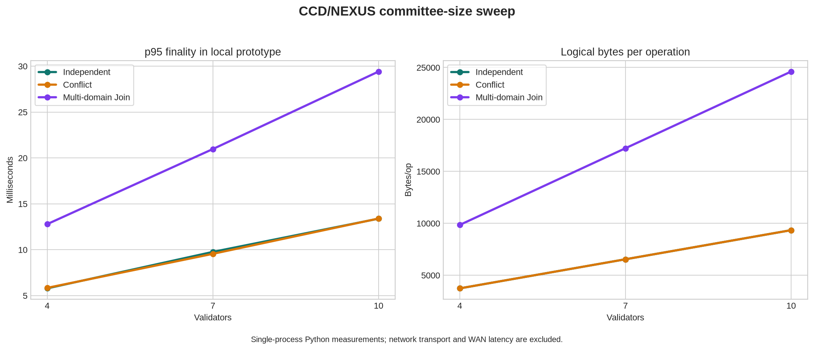

# تقرير القياس والمقارنة — CCD/NEXUS

## نطاق القياس

أُجريت القياسات على نموذج Python محلي داخل عملية واحدة، مع احتساب إنشاء التوقيعات Ed25519، والتحقق من DAC، وتصويت Prepare/Commit، وJoin للمعاملات متعددة المجالات. لم تُحتسب شبكة WAN، أو زمن RTT، أو جدولة CPU بين عقد مستقلة، أو فقد الرسائل؛ ولذلك لا تمثل النتائج زمن شبكة إنتاجية ولا يجوز تقديمها كأداء blockchain موزع.

> **قاعدة المقارنة:** الأرقام المحلية تقيس تنفيذ النواة والمنطق التشفيري فقط. الأرقام المنشورة في HotStuff وNarwhal/Tusk وSui Lutris مرتبطة ببيئات وتجهيزات وأحجام رسائل مختلفة، ولذلك تُستخدم هنا كمرجع معماري لا كخط أساس رقمي مباشر. [1] [2] [3]

## النتائج المحلية

استُخدم عدد 20 عملية لكل حمل، مع لجان من 4 و7 و10 validators. يقيس الحمل المستقل عمليات على كائنات مختلفة، ويقيس حمل التعارض تحديثات متتابعة للكائن نفسه، بينما يقيس Join عملية ذرية تمس مجالين.

| Validators | الحمل | Ops/s | p95 النهائية بالميلي ثانية | الرسائل/عملية | البايتات/عملية |
|---:|---|---:|---:|---:|---:|
| 4 | مستقل | 171.1322 | 5.7862 | 12 | 3,736.0 |
| 4 | تعارض | 170.9962 | 5.8411 | 12 | 3,736.0 |
| 4 | Join مجالين | 78.7960 | 12.7833 | 28 | 9,844.0 |
| 7 | مستقل | 103.8532 | 9.7600 | 21 | 6,538.0 |
| 7 | تعارض | 105.5200 | 9.5501 | 21 | 6,538.0 |
| 7 | Join مجالين | 47.8852 | 20.9673 | 49 | 17,227.0 |
| 10 | مستقل | 74.8589 | 13.3818 | 30 | 9,340.0 |
| 10 | تعارض | 74.5742 | 13.3956 | 30 | 9,340.0 |
| 10 | Join مجالين | 34.2389 | 29.4110 | 70 | 24,610.0 |

### قراءة النتائج

في هذا النموذج المحلي، لا يظهر فرق جوهري بين الحمل المستقل وحمل التعارض؛ وهذا متوقع لأن المسارين يستخدمان عدد مراحل التوقيع نفسه، ولأن الاختبار لا يشغل مجالات مستقلة بالتوازي عبر عمليات نقل حقيقية. تظهر كلفة Join بوضوح: عملية المجالين تحتاج DAC وتصويت Prepare وCommit لكل مجال، إضافة إلى توقيعات شهادة الدمج. كما تنمو الكلفة خطيًا تقريبًا مع حجم اللجنة لأن النموذج الحالي يحفظ توقيع كل validator بدل استخدام توقيع threshold مضغوط.

هذه النتيجة مهمة لأنها تكشف موضع التحسين التالي بدل إخفائه: **الابتكار لا يثبت بمجرد وجود مجالين؛ يجب تخفيض كلفة Join، واستخدام تنفيذ متوازٍ فعلي، وإضافة ضغط للشهادات، ثم اختبار الشبكة تحت RTT وفقد ورسائل مكررة**.

## المقارنة المعمارية

| النظام | وحدة القرار | مسار العمليات المستقلة | مسار التعارض | نوع الدليل المتاح هنا |
|---|---|---|---|---|
| HotStuff | ترتيب BFT عالمي يقوده قائد | تمر عبر المسار العالمي | المسار نفسه | ورقة أصلية وتحليل خوارزمي |
| Narwhal/Tusk | نشر DAG منفصل ثم إجماع/ترتيب | توازي في النشر مع قرار ترتيب | يمر عبر الإجماع | ورقة أصلية ونتائج منشورة غير قابلة للمقارنة المباشرة |
| Sui Lutris-style | كائنات ومسار اتفاق بلا إجماع لبعض العمليات + إجماع عند الوصولات المتعارضة | مسار سريع للمعاملات المؤهلة | ترتيب/إجماع عند التعارض | أقرب مرجع معماري منشور |
| CCD/NEXUS الحالي | مجال تعارض محلي + Join للعمليات العابرة | شهادة محلية لكل مجال | شهادات محلية أو Join | تنفيذ محلي واختبارات حتمية، دون شبكة موزعة بعد |

HotStuff صُمم لبروتوكول BFT بقيادة، مع responsiveness وتواصل خطي في ظروف الاستقرار، لكنه لا يزيل الترتيب العالمي. [1] أما Narwhal/Tusk فيفصل نشر المعاملات عن ترتيبها ويستفيد من DAG؛ وتذكر الورقة أرقامًا مرتفعة في بيئة WAN خاصة بها، لكن تلك الأرقام لا تُقارن مباشرةً مع تنفيذ Python المحلي. [2] ويقدم Sui Lutris أقرب فكرة وظيفية للمسار الحالي، إذ يدمج الاتفاق بلا إجماع للعمليات المؤهلة مع إجماع للعمليات التي قد تتعارض، ويستخدم الكائنات كوحدة حالة. [3]

## ما أُثبت فعليًا

نجحت الاختبارات الحالية في التحقق من النقاط التالية داخل النموذج المحدد: لا تُقبل شهادتا نصاب متعارضتان عندما يكون أقل من ثلث القوة بيزنطيًا ولا يوقع validator الصادق مرتين؛ لا يمكن تنفيذ عملية على إصدار قديم بعد commit؛ لا تُقبل DAC أو شهادة Commit معدلة؛ لا تُطبق عملية Join جزئيًا عندما يفشل أحد المجالات؛ لا تُقبل شهادة حقبة ببيان مختلف؛ ويُكتشف تغير الحالة بعد إصدار snapshot.

كما نجحت اختبارات استقصائية كاملة لمجموعات النصاب عند `f=1,2,3` وأحجام لجان `n=4,7,10`. إجمالي اختبارات pytest الحالية: **16 اختبارًا ناجحًا**.

## ما لم يُثبت بعد

لم يُثبت بعد أن النظام آمن في شبكة موزعة فعلية مع تأخير ورسائل متكررة وفقد وتوقف عقد أثناء Join. ولم تُثبت العضوية المفتوحة أو مقاومة Sybil أو اختيار اللجان. كما أن DAC في النموذج عبارة عن توقيعات على بيان العملية، وليس نظام erasure coding أو reliable broadcast موزعًا كاملًا. كذلك لم تُنفذ VM عامة، أو Merkle tree فعلي لإثباتات الحالة، أو تخزين دائم crash-safe، أو توقيع threshold مضغوط.

## الحكم المرحلي

النتيجة الحالية لا تسمح بالقول إن CCD/NEXUS أسرع أو أكثر أمانًا من HotStuff أو Narwhal/Tusk أو Sui Lutris. ما تسمح به هي القول إن لدينا **نواة بروتوكول قابلة للتشغيل** تحافظ على مجموعة invariants محددة في نموذج لجنة ثابتة، وتكشف بوضوح أن كلفة Join وشهادات اللجنة هي عنق الزجاجة الحالي.

لتحويل النواة إلى مساهمة بروتوكولية قابلة للدفاع، يجب تنفيذ النقل الموزع، وتوقيع threshold، وerasure-coded DAC، واختبارات fault injection، ثم تشغيل baselines حقيقية في البيئة نفسها. إذا بقي التحسن في p95 والبايتات والتخزين بعد هذه المقارنة الموحدة، يمكن صياغة ورقة بحثية أو RFC تدعي تحسينًا محددًا. أما الآن، فالعبارة العلمية الدقيقة هي: **فرضية معمارية واعدة ونموذج أولي ناجح جزئيًا، وليس نظامًا ثوريًا مثبتًا بعد**.

## المراجع

1. [Yin et al., “HotStuff: BFT Consensus in the Lens of Blockchain”](https://arxiv.org/abs/1803.05069)
2. [Danezis et al., “Narwhal and Tusk: A DAG-based Mempool and Efficient BFT Consensus”](https://arxiv.org/abs/2105.11827)
3. [Blackshear et al., “Sui Lutris: A Blockchain Combining Broadcast and Consensus”](https://arxiv.org/abs/2310.18042)
4. [Zhang et al., “Reaching Consensus in the Byzantine Empire: A Comprehensive Review of BFT Consensus Algorithms”](https://arxiv.org/html/2204.03181v3)
5. [Raikwar et al., “SoK: DAG-based Consensus Protocols”](https://arxiv.org/html/2411.10026v1)
